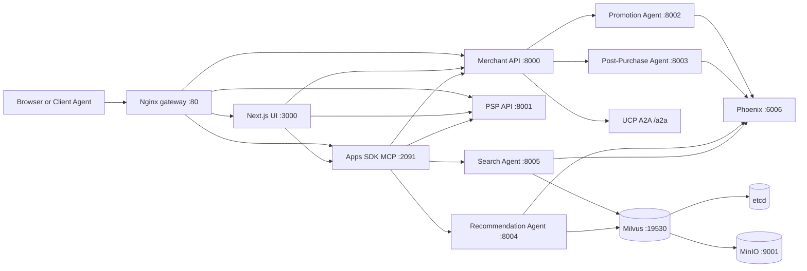

<div align="center">


# Agentic Commerce Provider

One-command Docker provider for an agentic commerce reference stack: storefront UI, merchant checkout, delegated payments, Apps SDK MCP tools, NVIDIA NeMo Agent Toolkit agents, Milvus retrieval, and Phoenix tracing behind a single gateway.

[](provider.metadata.json)
[](docker-compose.yml)
[](pyproject.toml)
[](src/ui/package.json)
[](LICENSE)

[Overview](#overview) - [System Flow](#system-flow) - [Quick Start](#quick-start) - [Pipelines](#application-pipelines) - [Deploy](#deployment-profiles) - [Repo Map](#repository-map) - [Docs](#docs-index)

</div>

## Overview

This repository packages a complete Agentic Commerce provider runtime. It is meant to be cloned, configured with an NVIDIA API key or local NIM runtime, and started with `bash runall.sh`.

| Layer | What ships | Source |
|---|---|---|
| Gateway | Nginx reverse proxy for UI, Merchant API, PSP API, and Apps SDK | `nginx.conf` |
| Storefront | Next.js protocol inspector with ACP/UCP checkout views, agent activity, metrics, and webhook handlers | `src/ui` |
| Merchant | FastAPI checkout sessions, catalog, metrics, ACP routes, UCP/A2A discovery and execution | `src/merchant` |
| PSP | FastAPI delegated payment vault token and payment intent simulation | `src/payment` |
| Apps SDK | FastAPI + MCP server with widget endpoints, cart tools, recommendations, search, checkout sessions, SSE events | `src/apps_sdk` |
| Agents | NAT promotion, post-purchase, recommendation, and search workflows | `src/agents` |
| Retrieval | Milvus product catalog seeded from `src/data/product_catalog.py`; MinIO and etcd support Milvus | `docker-compose.infra.yml` |
| Observability | Phoenix trace collector and UI for agent and LLM spans | `docker-compose.infra.yml` |
| Provider manifest | Metadata, ports, health checks, install/start/stop commands | `provider.metadata.json` |

## System Flow



## Quick Start

Prerequisites:

| Requirement | Notes |
|---|---|
| Docker Engine 24+ | Required by provider metadata |
| Docker Compose v2+ | Used by `runall.sh` and `stop.sh` |
| `curl` | Used by startup health checks |
| `bash` | Runtime scripts are shell scripts |
| `NVIDIA_API_KEY` | Required for `NIM_RUN_MODE=api` |
| NVIDIA GPU + NVIDIA Container Toolkit | Required only for `NIM_RUN_MODE=local_nim` |

Start with NVIDIA hosted API endpoints:

```bash
cp env.example .env
```

```env
NIM_RUN_MODE=api
NVIDIA_API_KEY=nvapi-...
```

```bash
bash runall.sh
```

Open the stack:

| Surface | URL |
|---|---|
| UI and gateway | `http://localhost` |
| Merchant health | `http://localhost/api/health` |
| PSP health | `http://localhost/psp/health` |
| Apps SDK health | `http://localhost/apps-sdk/health` |
| Phoenix | `http://localhost:6006` |
| MinIO console | `http://localhost:9001` |

Stop everything:

```bash
bash stop.sh
```

## Application Pipelines

### 1. Storefront Checkout

| Step | Component | Behavior |
|---|---|---|
| Search or browse | `src/ui`, `src/apps_sdk` | User selects products through the inspector or Apps SDK widget |
| Session create/update | `src/merchant/protocols/acp/api/routes/checkout.py` | Merchant creates checkout sessions and recalculates totals |
| Promotion | `src/merchant/services/promotion.py`, `src/agents/configs/promotion.yml` | Merchant computes context, NAT chooses an approved promotion action, merchant applies it deterministically |
| Payment delegation | `src/payment/api/routes/payments.py` | PSP creates single-use vault tokens and processes payment intents |
| Completion | `src/merchant/domain/checkout/service.py` | Merchant marks the order complete |
| Post purchase | `src/merchant/services/post_purchase.py`, `src/agents/configs/post-purchase.yml` | Agent generates shipping message; merchant sends ACP/UCP webhooks |

### 2. Apps SDK MCP Tools

| Tool | Purpose | Backing source |
|---|---|---|
| `search-products` | Semantic product search with widget output metadata | `src/apps_sdk/tools/recommendations.py` |
| `get-recommendations` | Personalized ARAG recommendations | `src/apps_sdk/main.py`, `src/agents/configs/recommendation.yml` |
| `add-to-cart`, `remove-from-cart`, `update-cart-quantity`, `get-cart` | In-memory cart operations for widget flows | `src/apps_sdk/tools/cart.py` |
| `create-checkout-session`, `update-checkout-session` | ACP checkout session lifecycle through Merchant API | `src/apps_sdk/tools/acp_sessions.py` |
| `checkout` | End-to-end cart checkout via Merchant and PSP | `src/apps_sdk/tools/checkout.py` |
| `track-recommendation-click` | Attribution event recording | `src/apps_sdk/main.py`, `src/merchant/services/recommendation_attribution.py` |

The MCP endpoint is mounted under `/apps-sdk/api/mcp` through the gateway. Widget HTML is served from `/apps-sdk/widget/merchant-app.html`.

### 3. Agent Runtime

| Agent | Config | Port | Runtime pattern |
|---|---|---:|---|
| Promotion | `src/agents/configs/promotion.yml` | 8002 | `chat_completion` strategy arbitration |
| Post-purchase | `src/agents/configs/post-purchase.yml` | 8003 | `chat_completion` multilingual message generation |
| Recommendation | `src/agents/configs/recommendation.yml` | 8004 | Sequential ARAG pipeline with parallel analysis and output guard |
| Recommendation ultrafast | `src/agents/configs/recommendation-ultrafast.yml` | optional | Single tool-calling variant for lower latency |
| Search | `src/agents/configs/search.yml` | 8005 | RAG retriever over Milvus `product_catalog` |

The default Docker flow builds one shared `nat-agents:latest` image and runs each agent with `nat serve`.

### 4. Metrics and Tracing

| Signal | Where it appears | Source |
|---|---|---|
| Agent outcome records | Metrics dashboard and Merchant metrics API | `src/merchant/api/routes/metrics.py` |
| Recommendation attribution | Impressions, clicks, purchases, top converting products | `src/merchant/services/recommendation_attribution.py` |
| UI agent activity | Right-side activity panel and webhook bridge | `src/ui/components/agent-activity`, `src/ui/components/WebhookToAgentActivityBridge.tsx` |
| Phoenix traces | Phoenix project UI | NAT config telemetry sections |

## Deployment Profiles

| Profile | Command | Use when |
|---|---|---|
| Full provider, hosted NVIDIA APIs | `bash runall.sh` with `NIM_RUN_MODE=api` | Fastest working path |
| Full provider, local NIM | `bash runall.sh` with `NIM_RUN_MODE=local_nim` | You have a compatible NVIDIA GPU runtime |
| Compose only | `docker compose -f docker-compose.infra.yml -f docker-compose.yml up -d --build` | You want manual Compose control |
| Infrastructure only | `docker compose -f docker-compose.infra.yml up -d` | You are developing services locally |
| Local NIM only | `docker compose -f docker-compose-nim.yml up -d` | You want host-exposed NIM endpoints on `8010` and `8011` |
| Milvus seed job | `docker compose -f docker-compose.infra.yml -f docker-compose.yml --profile seed run --rm milvus-seeder` | You need to seed or reseed vector search data |

`runall.sh` also checks port availability, creates `.env` from `env.example` when missing, validates `NIM_RUN_MODE`, waits for health endpoints, runs the Milvus seeder profile, and waits for search/recommendation agent health.

## Configuration

| Variable | Default | Used by |
|---|---|---|
| `HTTP_HOST_PORT` | `80` | Gateway host port |
| `NVIDIA_API_KEY` | `nvapi-xxx` placeholder | Hosted NVIDIA APIs and NIM images |
| `NIM_RUN_MODE` | `api` | Runtime selector: `api` or `local_nim` |
| `NIM_LLM_BASE_URL` | `https://integrate.api.nvidia.com/v1` | Agent LLM endpoint |
| `NIM_LLM_MODEL_NAME` | `nvidia/llama-3.1-nemotron-nano-8b-v1` | Default LLM model |
| `NIM_EMBED_BASE_URL` | `https://integrate.api.nvidia.com/v1` | Embedding endpoint |
| `NIM_EMBED_MODEL_NAME` | `nvidia/nv-embedqa-e5-v5` | Default embedding model |
| `MERCHANT_API_KEY` | `merchant-api-key-12345` | Merchant API auth |
| `PSP_API_KEY` | `psp-api-key-12345` | PSP API auth |
| `WEBHOOK_SECRET` | `whsec_demo_secret` | ACP/UCP webhook verification |
| `UCP_VERSION` | `2026-01-23` | UCP profile and negotiation code |
| `PHOENIX_UI_PORT` | `6006` | Phoenix UI and OTLP HTTP |
| `MINIO_CONSOLE_PORT` | `9001` | MinIO console |
| `MILVUS_PORT` | `19530` | Milvus gRPC |

Replace default keys and secrets before shared demos or production-like environments.

## Service Matrix

| Service | Container | Internal port | Public route or port |
|---|---|---:|---|
| Nginx | `nginx` | 80 | `http://localhost:${HTTP_HOST_PORT:-80}` |
| UI | `ui` | 3000 | `/` |
| Merchant API | `merchant` | 8000 | `/api/*` |
| PSP API | `psp` | 8001 | `/psp/*` |
| Apps SDK | `apps-sdk` | 2091 | `/apps-sdk/*` |
| Promotion Agent | `nat-promotion-agent` | 8002 | internal |
| Post-Purchase Agent | `nat-post-purchase-agent` | 8003 | internal |
| Recommendation Agent | `nat-recommendation-agent` | 8004 | internal |
| Search Agent | `nat-search-agent` | 8005 | internal |
| Milvus | `milvus-standalone` | 19530, 9091 | `MILVUS_PORT`, `MILVUS_METRICS_PORT` |
| MinIO | `milvus-minio` | 9000, 9001 | `MINIO_CONSOLE_PORT` |
| Phoenix | `phoenix` | 6006, 4317 | `PHOENIX_UI_PORT`, `PHOENIX_GRPC_PORT` |

## Screenshots

| Simulator | Checkout Flow |
|---|---|
|  |  |

| Agent Activity | Metrics |
|---|---|
|  |  |

| Phoenix | MinIO |
|---|---|
|  |  |

## Quality Gates

CI is already present under `.github/workflows`.

| Workflow | What it checks |
|---|---|
| `ci-cross-platform.yml` | Python compile and Ruff smoke on Ubuntu/Windows; UI typecheck on Ubuntu/Windows |
| `ci-matrix-linux.yml` | Docker builds for merchant, UI, Apps SDK, agents, and PSP on linux/amd64 and linux/arm64 |
| `ci-production-gates.yml` | Backend Ruff, pytest with coverage artifacts, frontend ESLint/typecheck/build, pip-audit, pnpm audit, Docker artifacts |

Useful local checks for README-only changes:

```bash
git diff --check
git status --short
```

Useful local checks before code changes:

```bash
uv sync --extra dev
uv run ruff check src/merchant src/apps_sdk src/payment tests
uv run pytest tests
```

```bash
cd src/ui
pnpm install --frozen-lockfile
pnpm run typecheck
pnpm run test:run
```

## Repository Map

```text
.
|-- .github/workflows/              # CI quality, security, and Docker build gates
|-- docs/images/                    # README and demo screenshots
|-- github-pipeline/pushgithub.md   # Team push checklist
|-- src/
|   |-- agents/                     # NAT configs, eval datasets, Milvus seeder
|   |-- apps_sdk/                   # FastAPI + MCP server and React/Vite widget
|   |-- data/                       # Seed product catalog
|   |-- merchant/                   # Merchant API, ACP/UCP protocols, metrics, services
|   |-- payment/                    # PSP delegated payment API
|   `-- ui/                         # Next.js protocol inspector and dashboard
|-- tests/                          # Python parser/unit smoke tests
|-- docker-compose.infra.yml        # Milvus, MinIO, etcd, Phoenix
|-- docker-compose-nim.yml          # Optional local NVIDIA NIM runtime
|-- docker-compose.yml              # App services, agents, seeder profile
|-- env.example                     # Runtime configuration template
|-- nginx.conf                      # Unified gateway routing
|-- provider.metadata.json          # Provider manifest for hub integration
|-- runall.sh                       # One-command startup
`-- stop.sh                         # Shutdown for app, infra, and local NIM
```

## Docs Index

| Document | Scope |
|---|---|
| `src/agents/README.md` | NAT agent architecture, configs, eval datasets, benchmark notes |
| `src/apps_sdk/README.md` | MCP server, widget, tool contracts, `window.openai` bridge |
| `src/agents/AGENTS.md` | Agent-specific coding guidance |
| `src/apps_sdk/AGENTS.md` | Apps SDK development guidance |
| `src/merchant/AGENTS.md` | Merchant service development guidance |
| `github-pipeline/pushgithub.md` | Project push and CI/CD checklist |
| `LICENSE`, `LICENSE-3rd-party.txt`, `LICENSE-assets.txt` | Licensing and asset notices |

## Operations

Tail runtime logs:

```bash
docker compose -f docker-compose.infra.yml -f docker-compose.yml logs -f --tail=100
```

Check container state:

```bash
docker ps --format "table {{.Names}}\t{{.Status}}\t{{.Ports}}"
```

Probe core services:

```bash
curl -f http://localhost/api/health
curl -f http://localhost/psp/health
curl -f http://localhost/apps-sdk/health
```

Check local NIM endpoints when using `NIM_RUN_MODE=local_nim`:

```bash
curl -f http://127.0.0.1:${NIM_LLM_HOST_PORT:-8010}/v1/models
curl -f http://127.0.0.1:${NIM_EMBED_HOST_PORT:-8011}/v1/models
```

## Security Notes

| Area | Note |
|---|---|
| Secrets | `.env` is ignored by Git; do not commit real `NVIDIA_API_KEY`, merchant keys, PSP keys, or webhook secrets |
| Demo defaults | `env.example` includes demo API keys and placeholder values for local testing |
| PSP tokens | PSP vault tokens are single-use and checked for idempotency conflicts |
| Proxying | UI proxy route tests cover SSRF-style path traversal and protocol injection cases |
| Production exposure | Restrict public ports and rotate all default secrets before shared environments |

## Provider Metadata

`provider.metadata.json` declares:

| Field | Value |
|---|---|
| Provider id | `agentic-commerce-blueprint-provider` |
| Category | `commerce` |
| Runtime | `docker-compose` |
| Entrypoint | `bash runall.sh` |
| Stop command | `bash stop.sh` |
| Required environment | `NVIDIA_API_KEY` |
| Public ports | Gateway `80`, Phoenix `6006`, MinIO console `9001` |
| Health checks | Merchant, PSP, Apps SDK |

## Notes On Accuracy

Last source review for this README: 2026-05-14.

This README is grounded in the current files in this repository: Compose files, runtime scripts, provider metadata, CI workflows, FastAPI entrypoints, Apps SDK tool registration, NAT configs, tests, and screenshots. It intentionally describes implemented surfaces only. Agent quality metrics and deeper NAT benchmark details remain in `src/agents/README.md`, where the agent-specific documentation lives.

## License

Main project license: `LICENSE`.

Third-party notices: `LICENSE-3rd-party.txt`.

Asset notices: `LICENSE-assets.txt`.
