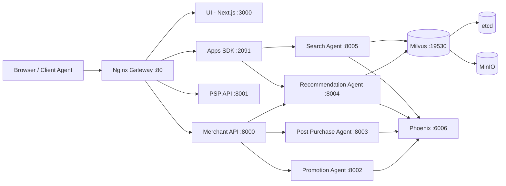
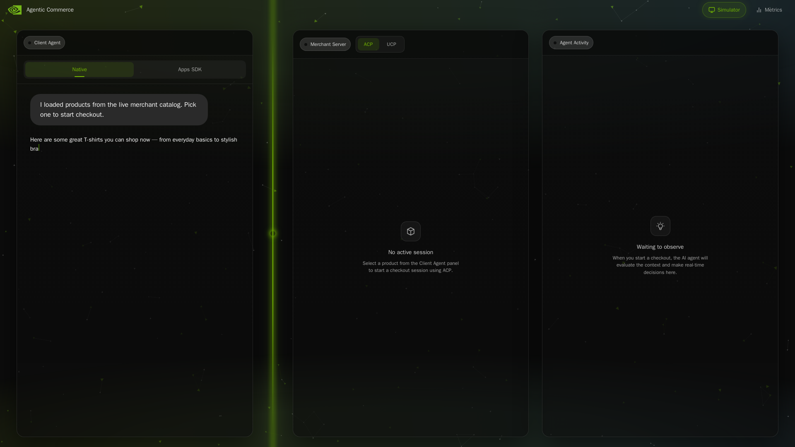
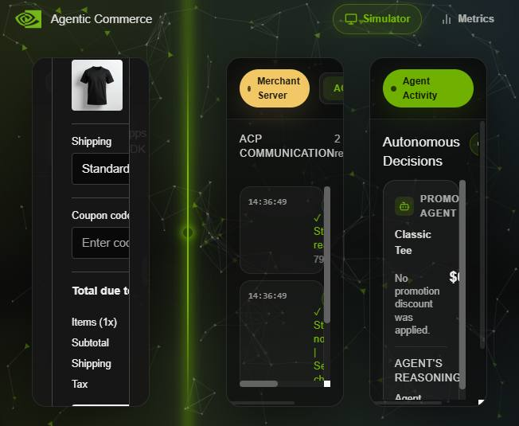
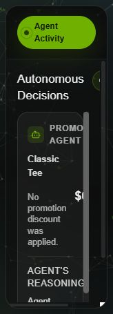
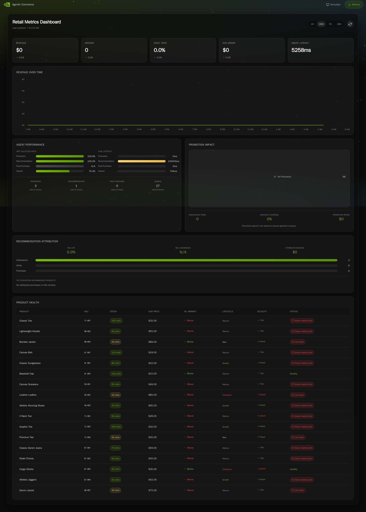
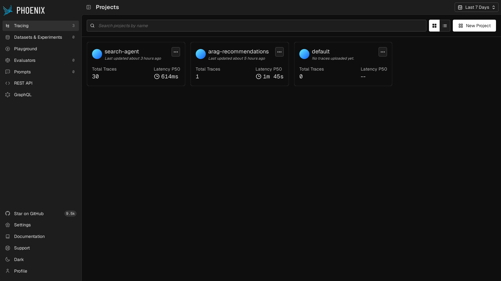
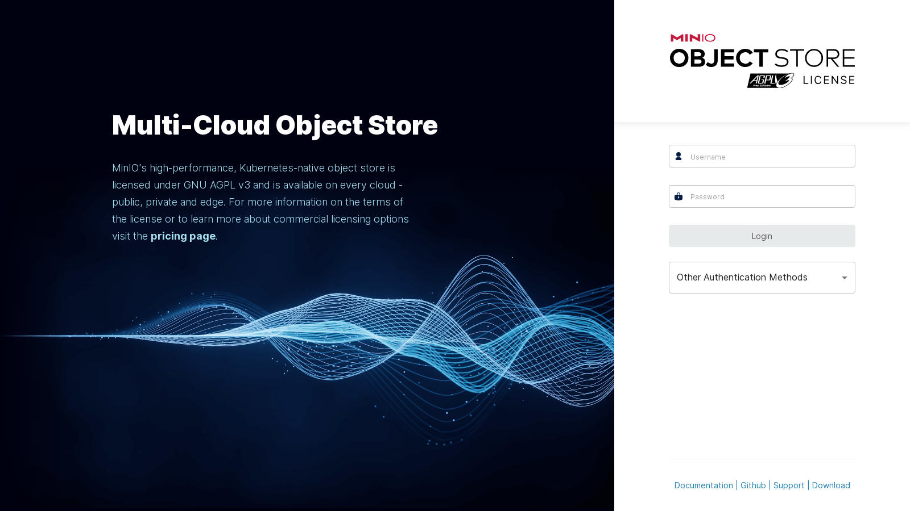

# Agentic Commerce Provider

[](provider.metadata.json)
[](docker-compose.yml)
[](LICENSE)

Production-ready provider package for deploying the full Agentic Commerce platform with a single command.

This repository ships a complete Docker-based runtime including:
- Next.js storefront UI
- Merchant API
- PSP (Payment Service Provider) API
- Apps SDK server
- NVIDIA NeMo Agent Toolkit agents (promotion, post-purchase, recommendation, search)
- Milvus + MinIO + etcd infrastructure
- Phoenix observability
- Nginx API/UI gateway

## Table of Contents
- [Why This Repository](#why-this-repository)
- [Architecture](#architecture)
- [Services](#services)
- [Prerequisites](#prerequisites)
- [Quick Start](#quick-start)
- [Configuration](#configuration)
- [Run Modes](#run-modes)
- [Operations Guide](#operations-guide)
- [Troubleshooting](#troubleshooting)
- [Security Notes](#security-notes)
- [Provider Metadata](#provider-metadata)
- [Screenshots](#screenshots)
- [Screenshot Checklist](#screenshot-checklist)
- [Repository Layout](#repository-layout)
- [License](#license)

## Why This Repository
Use this provider when you want to:
- Deploy a demo or reference Agentic Commerce stack quickly
- Run commerce flows through a unified gateway (`http://localhost`)
- Keep infrastructure and app services reproducible via Docker Compose
- Integrate with hub/provider workflows via metadata-driven runtime commands

## Architecture


## Services
| Layer | Service | Purpose | Access |
|---|---|---|---|
| Gateway | Nginx | Unified routing for UI + APIs | `http://localhost:${HTTP_HOST_PORT:-80}` |
| Frontend | UI (Next.js) | Storefront and webhook handlers | via gateway |
| Core API | Merchant | Catalog/order orchestration and agent triggers | `/api/*` |
| Core API | PSP | Payment simulation endpoints | `/psp/*` |
| Integration | Apps SDK | App/tool endpoints and recommendation/search integration | `/apps-sdk/*` |
| Agents | Promotion/Post-purchase/Recommendation/Search | NAT-based commerce intelligence | internal |
| Vector DB | Milvus | Embedding and vector search storage | `${MILVUS_PORT:-19530}` |
| Storage | MinIO | Object storage backend for Milvus | console `${MINIO_CONSOLE_PORT:-9001}` |
| Tracing | Phoenix | LLM/agent observability | `${PHOENIX_UI_PORT:-6006}` |

## Prerequisites
- Docker Engine 24+
- Docker Compose v2+
- `curl` available in host shell
- API mode: valid `NVIDIA_API_KEY`
- Local NIM mode: NVIDIA GPU + NVIDIA Container Toolkit + runtime `nvidia`

## Quick Start
1. Clone and enter repository.
2. Create environment file.

```bash
cp env.example .env
```

3. Set minimum required configuration in `.env`.

```env
NIM_RUN_MODE=api
NVIDIA_API_KEY=nvapi-...
```

4. Start the full stack.

```bash
bash runall.sh
```

5. Open and verify:
- UI: `http://localhost:${HTTP_HOST_PORT:-80}`
- Merchant health: `http://localhost:${HTTP_HOST_PORT:-80}/api/health`
- PSP health: `http://localhost:${HTTP_HOST_PORT:-80}/psp/health`
- Apps SDK health: `http://localhost:${HTTP_HOST_PORT:-80}/apps-sdk/health`

Stop everything:

```bash
bash stop.sh
```

## Configuration
`runall.sh` auto-creates `.env` from `env.example` if missing, but you should still review values before production usage.

### Required Variables
| Variable | Required When | Description |
|---|---|---|
| `NVIDIA_API_KEY` | `NIM_RUN_MODE=api` | API key for NVIDIA public endpoints |
| `NIM_RUN_MODE` | always | `api` or `local_nim` |

### Commonly Tuned Variables
| Variable | Default | Notes |
|---|---|---|
| `HTTP_HOST_PORT` | `80` | Gateway host port |
| `MINIO_CONSOLE_PORT` | `9001` | MinIO UI |
| `MILVUS_PORT` | `19530` | Milvus gRPC |
| `PHOENIX_UI_PORT` | `6006` | Phoenix dashboard |
| `MERCHANT_API_KEY` | demo key | Merchant API auth key |
| `PSP_API_KEY` | demo key | PSP API auth key |
| `WEBHOOK_SECRET` | demo secret | Webhook signature verification |

## Run Modes
### 1) API Mode (default)
- Uses NVIDIA hosted endpoints
- Fastest setup path
- Requires valid `NVIDIA_API_KEY`

```env
NIM_RUN_MODE=api
NIM_LLM_BASE_URL=https://integrate.api.nvidia.com/v1
NIM_EMBED_BASE_URL=https://integrate.api.nvidia.com/v1
```

### 2) Local NIM Mode
- Starts local NIM containers from `docker-compose-nim.yml`
- Waits for `/v1/models` on both LLM and embedding endpoints before app boot
- Requires compatible NVIDIA GPU runtime

```env
NIM_RUN_MODE=local_nim
NIM_LLM_BASE_URL=http://host.docker.internal:8010/v1
NIM_EMBED_BASE_URL=http://host.docker.internal:8011/v1
```

## Operations Guide
### Start
```bash
bash runall.sh
```

### Stop
```bash
bash stop.sh
```

### Check Running Containers
```bash
docker ps --format "table {{.Names}}\t{{.Status}}\t{{.Ports}}"
```

### Tail Logs
```bash
docker compose -f docker-compose.infra.yml -f docker-compose.yml logs -f --tail=100
```

### Health Checks
```bash
curl -f http://localhost:${HTTP_HOST_PORT:-80}/api/health
curl -f http://localhost:${HTTP_HOST_PORT:-80}/psp/health
curl -f http://localhost:${HTTP_HOST_PORT:-80}/apps-sdk/health
```

## Troubleshooting
### `NVIDIA_API_KEY missing in .env`
- Ensure `.env` exists and key is not placeholder `nvapi-xxx`

### Core health checks timeout during startup
- Check container status with `docker ps`
- Inspect logs for failing service
- Ensure port conflicts are resolved (`HTTP_HOST_PORT`, `PHOENIX_UI_PORT`, `MINIO_CONSOLE_PORT`)

### Local NIM endpoints not ready
- Verify GPU runtime is available to Docker
- Verify `docker-compose-nim.yml` containers are healthy
- Validate:

```bash
curl -f http://127.0.0.1:${NIM_LLM_HOST_PORT:-8010}/v1/models
curl -f http://127.0.0.1:${NIM_EMBED_HOST_PORT:-8011}/v1/models
```

### Agent health check fails
- `search-agent` and `recommendation-agent` depend on Milvus readiness
- Confirm `milvus-standalone`, `milvus-etcd`, and `milvus-minio` are healthy

## Security Notes
- Replace all default/demo secrets before shared or production environments
- Do not commit real API keys or secrets to Git
- Keep `.env` out of source control
- Restrict externally exposed ports in production deployments

## Provider Metadata
Hub integration metadata is defined in `provider.metadata.json`, including:
- provider identity and version
- runtime commands (`install/start/stop`)
- dependency constraints
- health checks and exposed ports

## Screenshots
### Simulator


*Home view of the simulator with client, merchant, and agent activity panels.*

### Checkout Flow


*Product selection with checkout modal, live merchant communication, and decision updates from agents.*

### Agent Activity


*Focused view of autonomous agent decisions and reasoning output during checkout.*

### Metrics Dashboard


*Commerce performance and product-health metrics in the platform dashboard.*

### Phoenix Tracing


*LLM and agent tracing projects for observability and debugging workflows.*

### MinIO Console


*Infrastructure storage console used by Milvus dependencies in this deployment.*

## Screenshot Checklist
If you want this README to look like top GitHub repos, add screenshots/GIFs for these sections:

1. [x] Hero screenshot (full UI home page)
2. [x] End-to-end flow (browse -> add to cart -> checkout)
3. [x] Agent interaction panel/log (promotion/recommendation/search in action)
4. [x] Phoenix tracing dashboard
5. [x] MinIO console (optional, for infrastructure visibility)
6. [ ] Terminal startup success (`bash runall.sh` final ready output)

Recommended image specs:
- UI screenshots: 1920x1080 PNG
- Dashboard screenshots: 1600x900 PNG
- Demo GIF: 10-20 seconds, <= 12 MB

Recommended placement in repo:
- `docs/images/hero.png`
- `docs/images/metrics.png`
- `docs/images/checkout-flow.jpg`
- `docs/images/agents.jpg`
- `docs/images/phoenix.png`
- `docs/images/minio.png`
- `docs/images/startup.png`

All currently available screenshots are embedded above.

## Repository Layout
```text
.
├─ docker-compose.infra.yml    # Milvus, MinIO, etcd, Phoenix
├─ docker-compose.yml          # Application services and agents
├─ docker-compose-nim.yml      # Optional local NVIDIA NIM runtime
├─ env.example                 # Environment template
├─ runall.sh                   # One-command startup flow
├─ stop.sh                     # Unified shutdown
├─ provider.metadata.json      # Hub/provider manifest
└─ src/
   ├─ ui/                      # Next.js frontend
   ├─ merchant/                # Merchant API
   ├─ payment/                 # PSP API
   ├─ apps_sdk/                # Apps SDK server
   └─ agents/                  # NAT agent configs + runtime
```

## License
- Main project license: see `LICENSE`
- Third-party notices: `LICENSE-3rd-party.txt`
- Asset notices: `LICENSE-assets.txt`
